# 바닐라 JS 프로젝트 성능 개선

- url: [vercel](https://front-3rd-chapter4-2-basic-sepia.vercel.app/)

## 성능 개선 보고서

### 1. static image 최적화

- `jpg` 확장자를 `webp`로 포맷

| 이미지 이름      | 원본 용량 (JPEG) | 최적화 용량 (WebP) | 용량 차이 | 감소 % |
| ---------------- | ---------------- | ------------------ | --------- | ------ |
| Hero_Desktop.jpg | 1.1 MB           | 634 kB             | 492 kB    | 43.7%  |
| Hero_Tablet.jpg  | 789 kB           | 446 kB             | 343 kB    | 43.4%  |
| Hero_Mobile.jpg  | 415 kB           | 226 kB             | 189 kB    | 45.5%  |
| vr1.jpg          | 54.1 kB          | 29.7 kB            | 24.4 kB   | 45.1%  |
| vr2.jpg          | 91.1 kB          | 47.9 kB            | 43.2 kB   | 47.4%  |
| vr3.jpg          | 76.8 kB          | 38.7 kB            | 38.1 kB   | 49.6%  |

- `webp`를 선택한 이유
  1. 높은 압축 효율성 - 빠른 로딩이 가능
  2. 높은 품질 - jpg에 비해 동일 비트레이트에서 다 나은 품질 제공
  3. 기타 투명도 지원, 애니메이션 지원 등 다양한 기능 지원

---

### 2. picture 태그를 활용한 반응형 리소스 적용

- 적용 전
  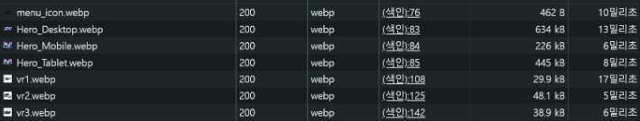

- 적용 후
  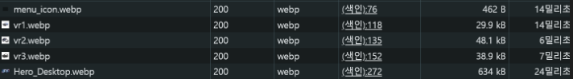

- 뷰포트 크기에 따라 맞는 이미지 노출
- 해당 뷰포트에서 쓰이지 않는 이미지는 로드하지 않아 리소스를 줄일 수 있다.

---

### 3. CLS 개선

- 개선 전
  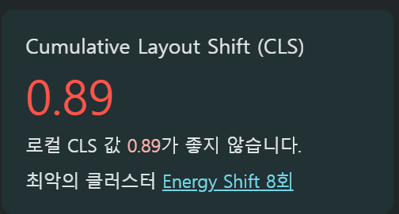

- 개선 후
  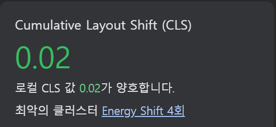

| 항목                          | 이전 값 | 현재 값 | 감소량 |
| ----------------------------- | ------- | ------- | ------ |
| Cumulative Layout Shift (CLS) | 0.89    | 0.02    | 0.87   |

1. 가장 큰 영향을 끼진 All Products 리스트 개선

   - 개선 전 `0.645`
     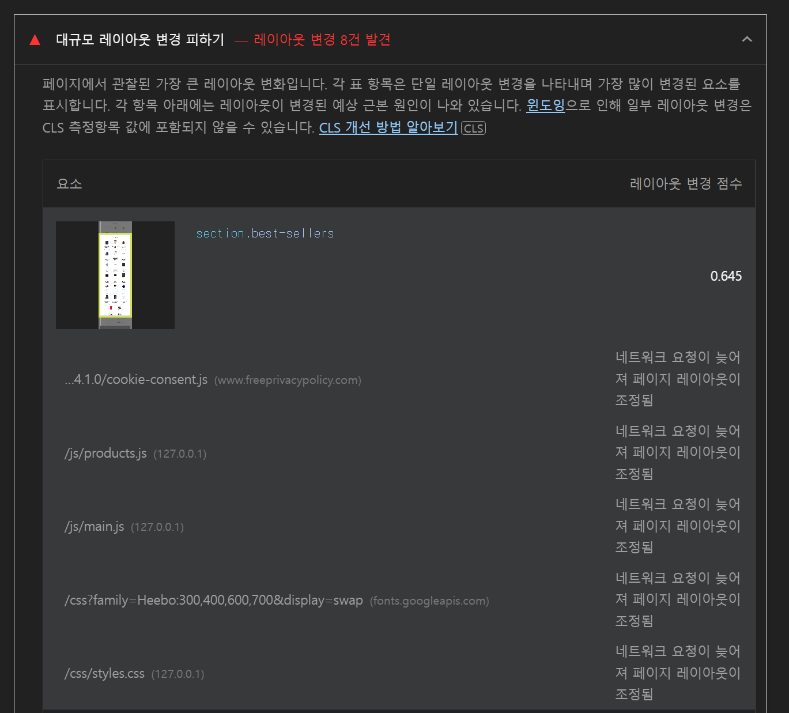

   - 개선 후 `0.016`
     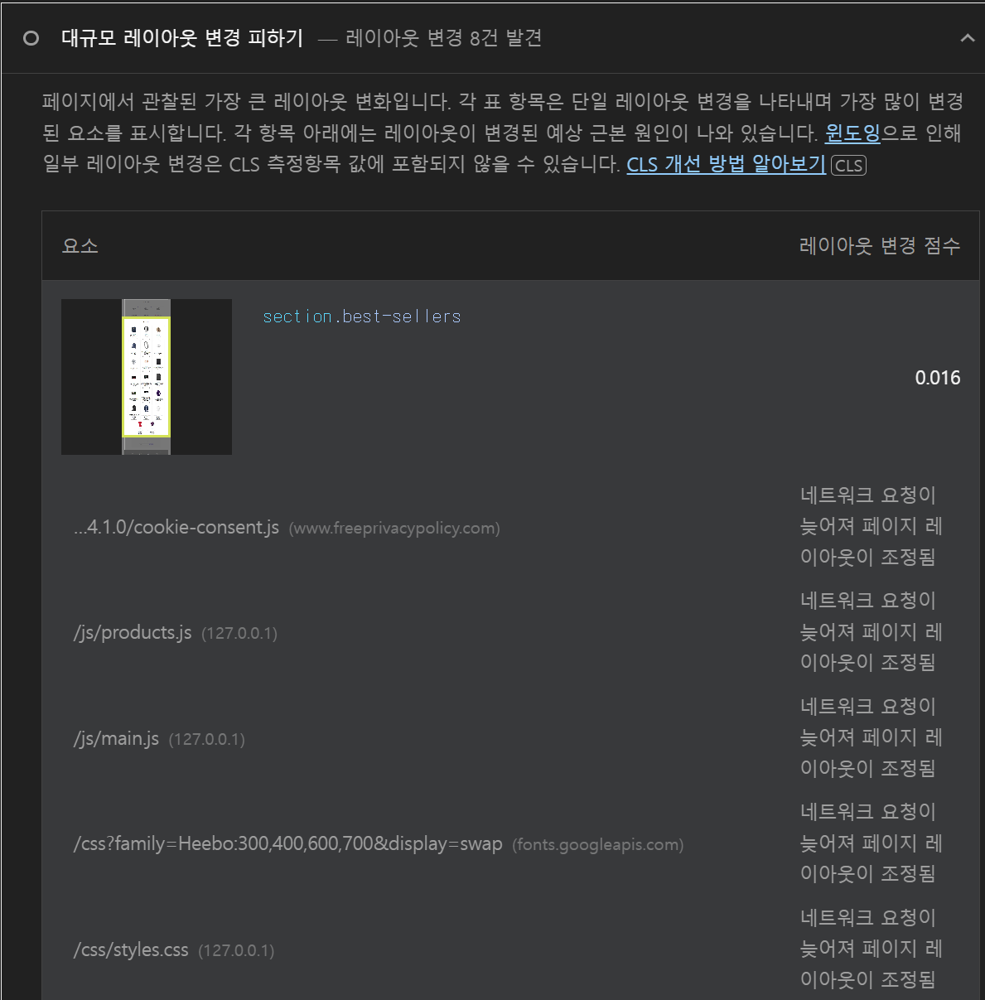

   - 개선 방법

     1. 스켈레톤 UI를 통한 CLS 개선 -> load 전 스켈레톤을 통해 loading을 시각화 하여 타 엘리먼트의 밀림 현상을 방지하고 UX 면에서도 부자연스러운 움직임을 해소
     2. load 전 명시적인 height을 표기하여 load 후 엘리먼트의 크기가 확 커지는 포인트를 해소

2. Hero 이미지에 명시적인 높이를 설정하여 load 전까지 일정 높이를 유지하여 CLS 개선

---

### 4.접근성 개선

- 개선 전
  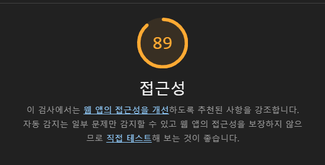

- 개선 후
  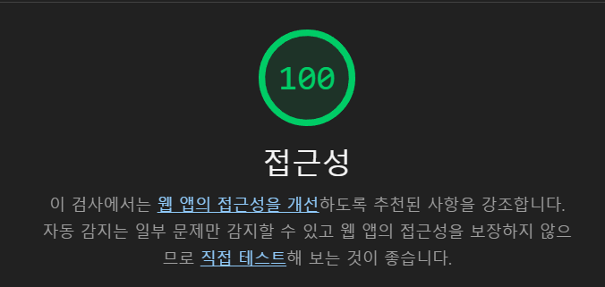

#### 색상 대비율 개선

- [네이버 - 명도 대비](https://accessibility.naver.com/acc/guide_04)
- 저시력자, 고령자 등도 인식할 수 있도록 콘텐츠와 배경 간의 명도 대비는 4.5:1 이상이어야 한다.
- 바로 조절하면서 개선할 수 있는 사이트에서 all pass하는 컬러를 찾는 방향으로 진행

1. blue color 개선

   - 개선 전
     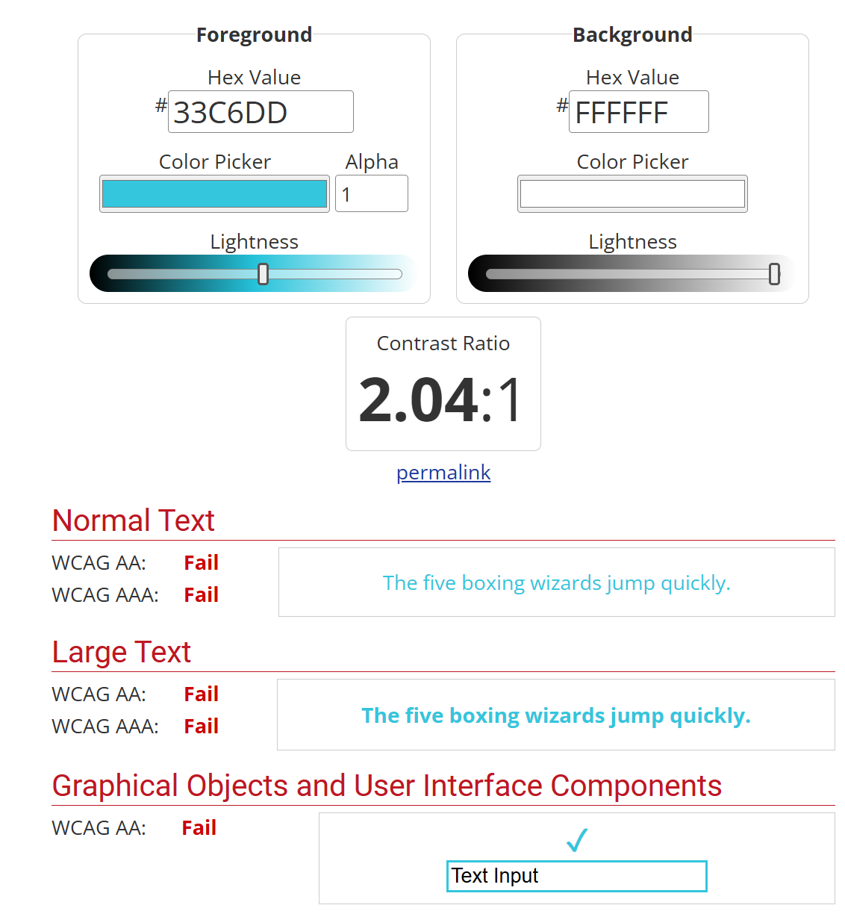

   - 개선 후
     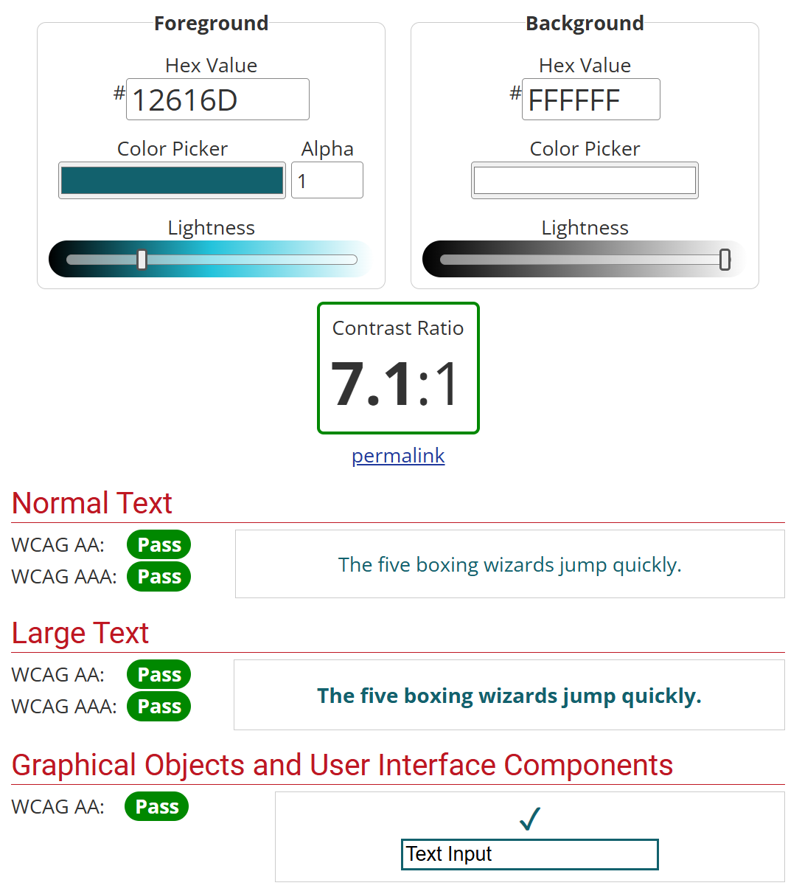

2. gray color 개선

   - 개선 전
     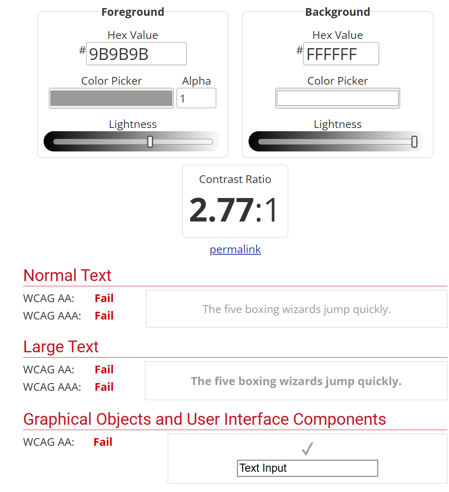

   - 개선 후
     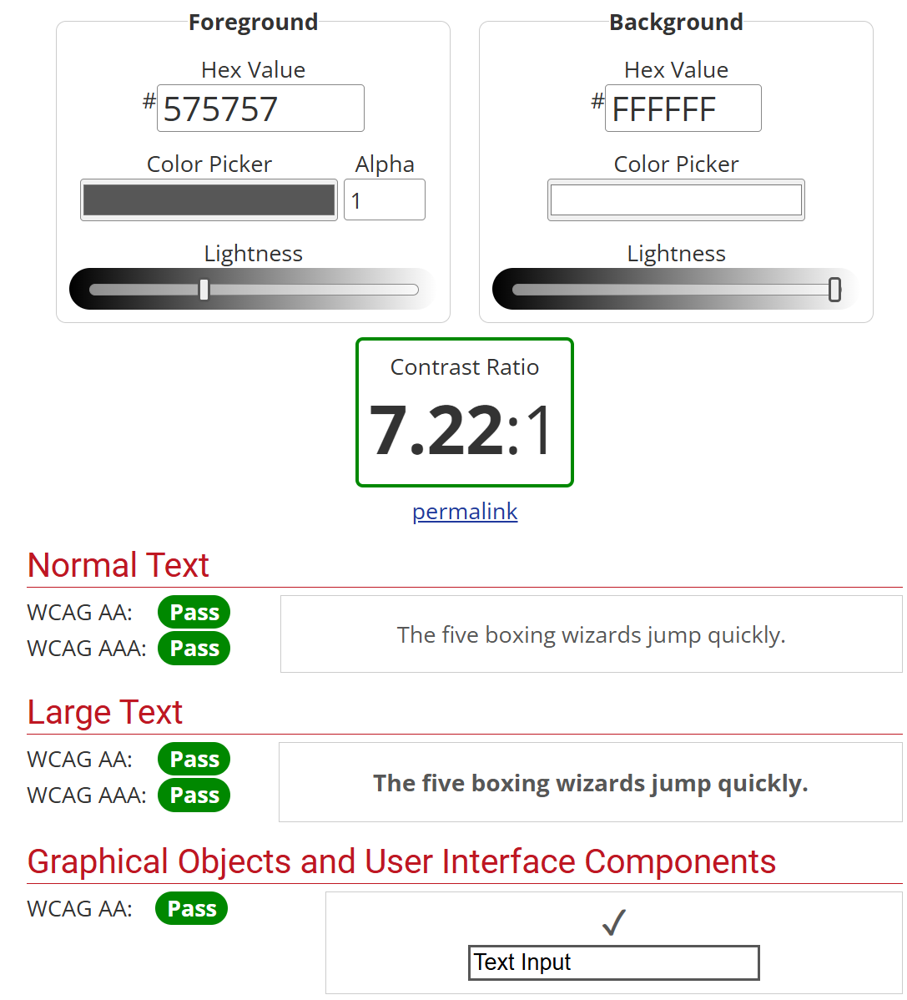

#### Heading levels 개선

- 문제
  - 일단 각 `product card`에서 `heading level`의 순서 정렬이 안되어 있었다 (`h5 - h4 - h3` 순)
  - `h1 ~ h6` 까지 순차적으로 `level`을 사용 해야 한다.
- 해결

  - `product card` 내에서는 타이틀을 `h2`로 지정하는게 적절하다고 판단
  - 중요도에 따라서 그리고 계층구조를 최대한 해치지 않으려면 h2 까지만 쓰는것이 옳다고 판단
  - `h2`를 사용한 이유는 상위 `section`태그 하위에 `h1 - All Products`가 존재하기에 그 다음 레벨은 `h2` 사용

#### img 태그의 누락된 alt 속성 추가

- 대체 텍스트를 작성할 때는 대체 텍스트의 목적이 시각 장애인 사용자에게 이미지의 내용과 목적에 대한 정보를 전달되어야 한다.
- 시각 장애인 사용자는 시각 장애인 사용자가 이미지 자체에서 얻는 것만큼의 정보를 대체 텍스트에서 얻을 수 있어야 한다.
- 대체 텍스트는 이미지의 의도, 목적, 의미를 제공해야 한다.

---

### 5. errors-in-console / FCP, LCP 개선

- [브라우저 오류가 콘솔에 로깅되었습니다.](https://developer.chrome.com/docs/lighthouse/best-practices/errors-in-console?hl=ko)

- `Uncaught TypeError: Cannot read properties of null (reading 'insertAdjacentElement')` 오류는 js 코드가 `DOM` 요소를 찾지 못할 때 발생한다
- 이 경우, `cookieconsent.run` 함수가 실행될 때, 해당 요소가 존재하지 않거나 아직 DOM에 추가되지 않았기 때문에 발생하는 문제이다.

- js 코드가 DOM이 완전히 로드된 후에 실행되도록 `DOMContentLoaded` 이벤트를 사용하여 코드를 감싸는 것이 좋다.
- 이렇게 하면 DOM 요소가 존재할 때만 코드가 실행된다.

---

### 6. 렌더링 차단 리소스 제거하기 / FCP, LCP 개선

- [렌더링 차단 리소스 제거](https://developer.chrome.com/docs/lighthouse/performance/render-blocking-resources?utm_source=lighthouse&utm_medium=devtools&hl=ko)

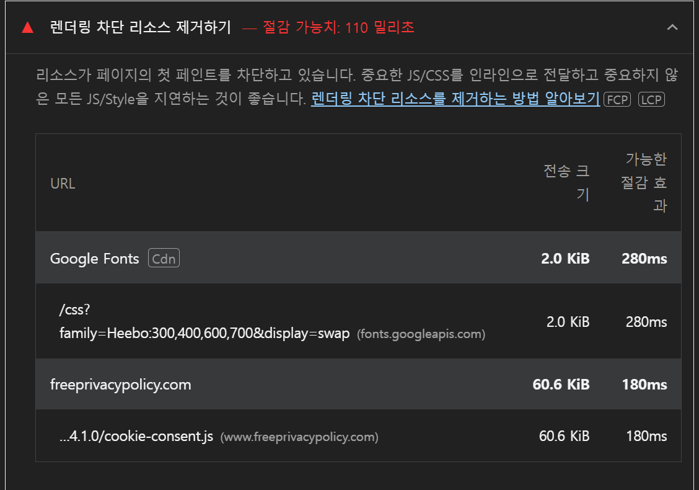

- 현재 미사용 100% 코드
  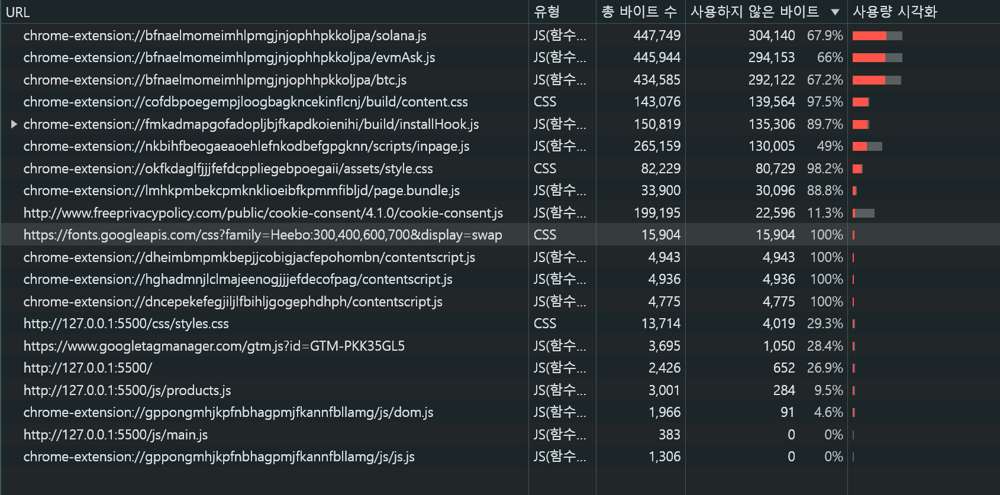

  - 렌더링 차단 리소스를 제거하기 위해 Google Fonts와 같은 외부 스타일시트를 최적화하는 방법은?
    - `rel="preload"`와 `as="style"` 사용
    - CSS 파일을 미리 로드하고, 로드가 완료된 후 `rel` 속성을 `stylesheet`로 변경하여 스타일을 적용한다.
    - 이 방법은 CSS 파일이 렌더링 차단을 최소화하도록 도와준다.

- `onload`: CSS 파일이 로드된 후 rel 속성을 stylesheet로 변경하여 스타일을 적용한다
- `<noscript>`: js가 비활성화된 경우를 대비하여 기본적으로 스타일시트를 로드한다.

```html
<!-- 변경 전 -->
   <link
  href="https://fonts.googleapis.com/css?family=Heebo:300,400,600,700&display=swap"
  rel="stylesheet"
/>

<!-- 변경 후 -->
<link
  href="https://fonts.googleapis.com/css?family=Heebo:300,400,600,700&display=swap"
  rel="preload"
  as="style"
  onload="this.onload=null;this.rel='stylesheet'"
/>
<noscript>
  <link
    rel="stylesheet"
    href="https://fonts.googleapis.com/css?family=Heebo:300,400,600,700&display=swap"
  />
</noscript>
```

- 개선 전
  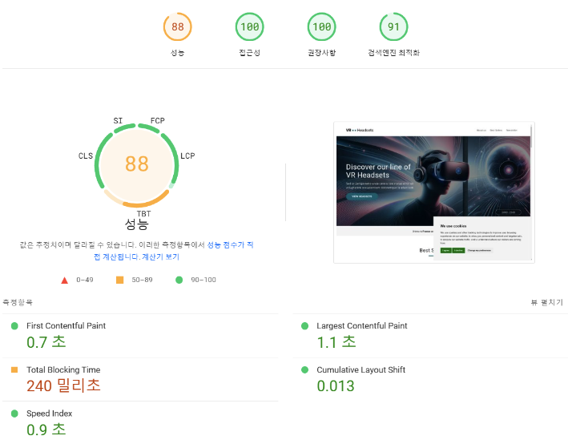

- 개선 후
  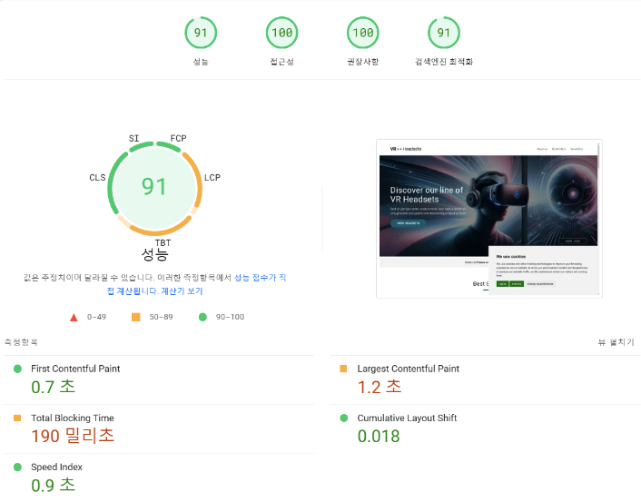

---

### 7. LCP 개선

- 초반에 hero 이미지에 `lazy: loading`과 `fetchpriority="high"` 속성이 적용되어 있었다.
- 초기 로딩 시에 바로 보여줘야 하는 부분이고 이 두 속성은 상충되는 관계였다..
- 그래서 두 속성을 제거하고 성능 측정을 해보니 LCP가 크게 개선이 되었다.
- 🚨 이유를 계속 찾아보려 했는다 딱 깔끔하게 결론이 안나네요..

- 개선 전
  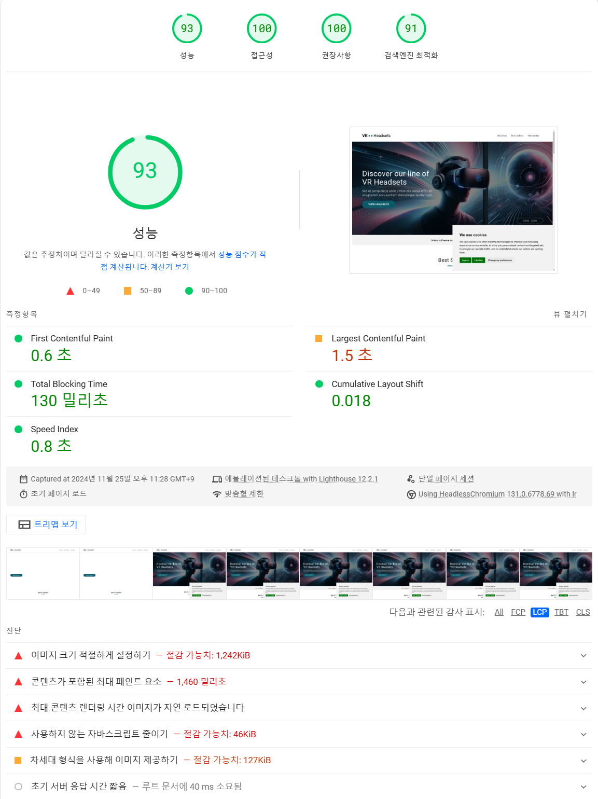

- 개선 후
  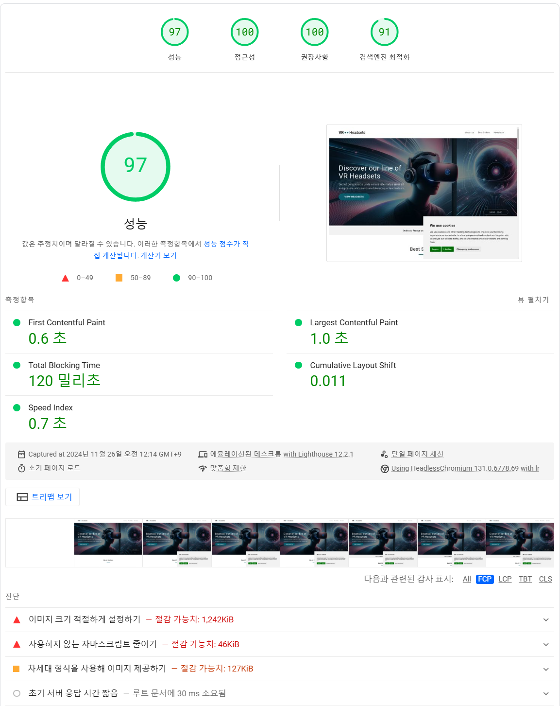

---

### 최종 개선 전

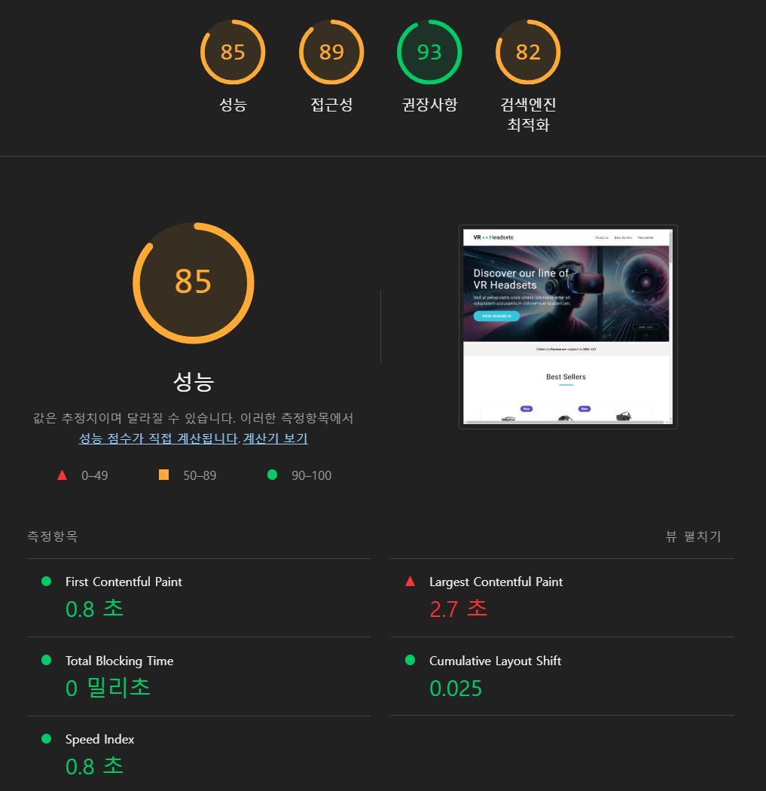

### 최종 개선 후

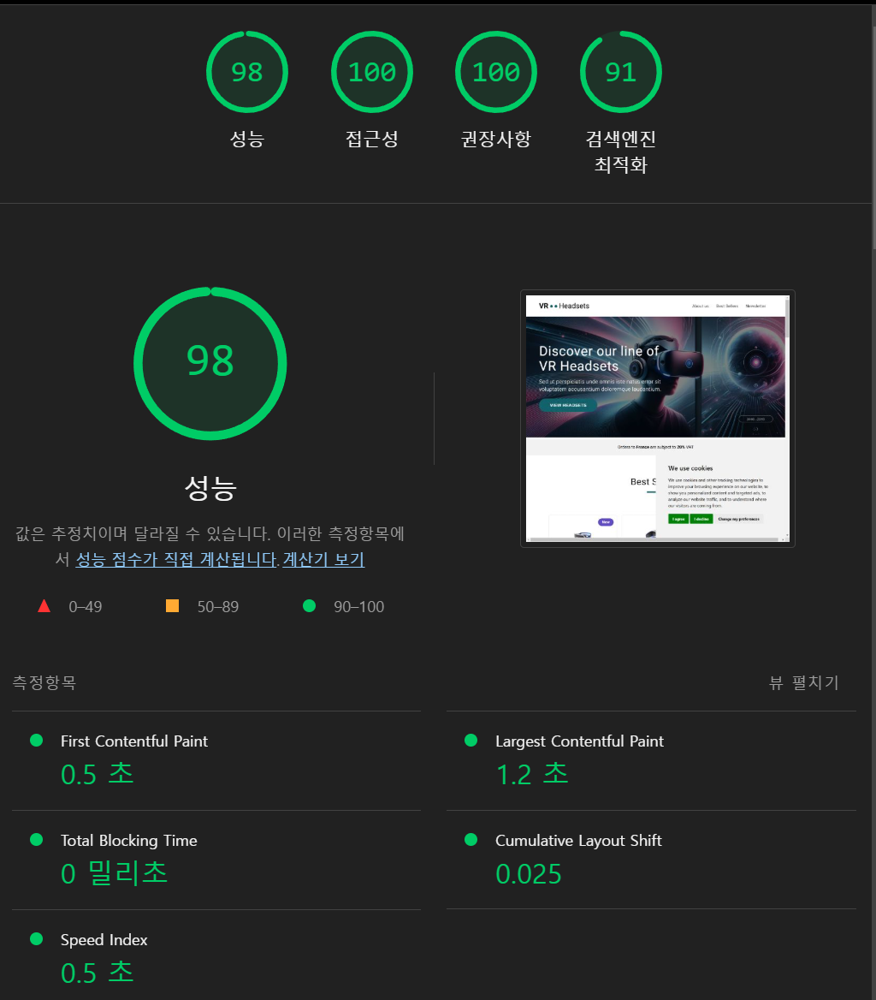

---

ps. 깃허브의 라이트 하우스 이슈의 경우 너무 결과가 왔다갔다 하는데.... 마음이 아픕니다
